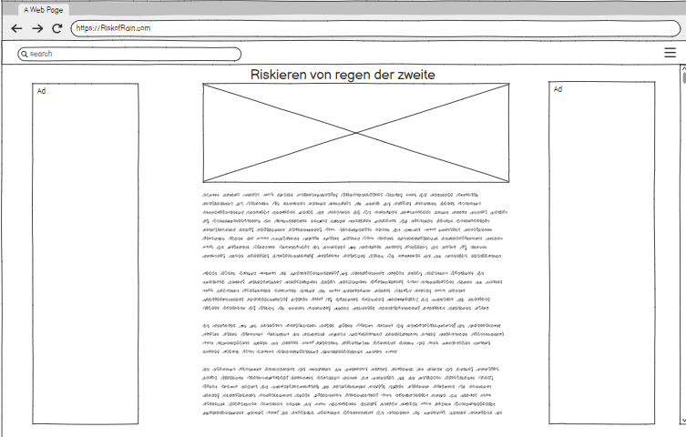
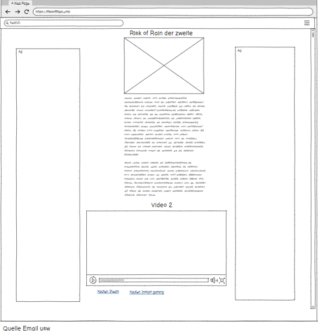
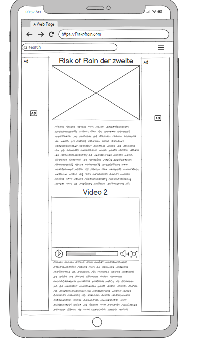
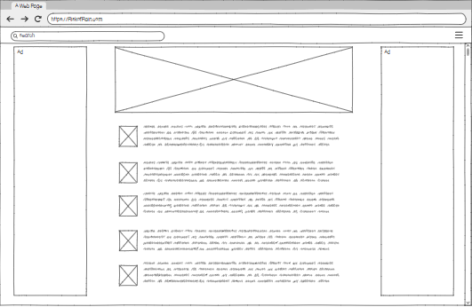
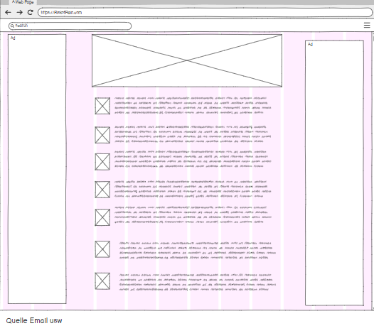
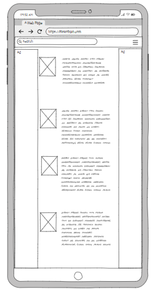

<h1> Inhalt </h1>

## Inhaltsverzeichnis
1. [Einleitung](#einleitung)
   1. [Ziel](#zielsetzung)
   2. [Ideen](#ideen)
   3. [Designe](#designe)
2. [Vorlagen](#vorlagen)
   1. [Seite: GE](#seite-game-erklärung)
   2. [Seite: Item Index](#seite-item-index)
3. [Demo](#demo)

# Einleitung

## Zielsetzung
Das ziehl unsere Webseite ist es leute das Spiel Risk of Rain näherzubringen 

## Ideen 
<!--Alles in klammer sind noch unklar -->
- Risk of Rain Game Erklärung
- DLC Werbung
- Trailer
- (Newsletter Formular / Gamergruppe Anmeldung / fehler meldung)
- Relevante Items Index
- Charakter Index
- Latest Fixes / updated
- Lustige Bewertungen
- Beste Mods
- Buy on Steam / Instant-gaming

## Design
- Dunkles Design
- Oranger Titel + Knöpfe
- Schriftart: Arial
- Trailer zuletzt
- Bild zuoberst

## Publishing Art
Wir haben für das Publishen der Website Github Pages verwendet. Grundsätzlich mussten wir unser Visual Studio Code nur mit GitHub verbinden. Nun können wir problemlos committen und pushen. 

 
 

# Vorlagen

## Seite: Game Erklärung

### Pc 

### ausgeklappt 

### Handy 

 

## Seite Item Index

### Pc 

### ausgeklappt 

### Handy 

## Demo
https://evencodesmith.github.io/Risk-of-Rain-Website/
